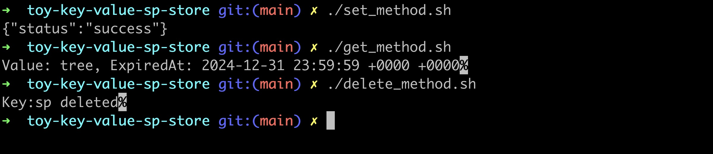

### SP Toy Key value store

## How to run

Give permission to postgres-init to execute script to create users

```shell
chmod +x ./postgres-init/*.sh
chmod +x ./start_method.sh
chmod +x ./get_method.sh
chmod +x ./delete_method.sh
```

start the docker to run the the postgres database and pgbouncer

```shell
docker-compose up --build
```

start the application

```shell
go run application.go
```

## SP Toy key value store

Toy key value store key as string and value as text and has an expired at.

## set key value expired_at

To set the `key`,`value` and `expired_at` update the json on the `set_method.sh`.
and run

```shell
./set_method.sh
```

## get value for specific key

To get the `value` and `expired_at` for a key on the `get_method.sh`.

```shell
./get_method.sh
```

## delete value for specific key

To delete a `key`, set the key in the `delete_method.sh`

```shell
./delete_method.sh
```


